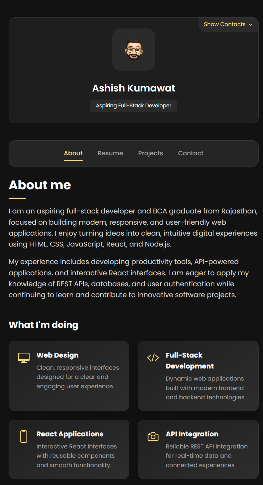
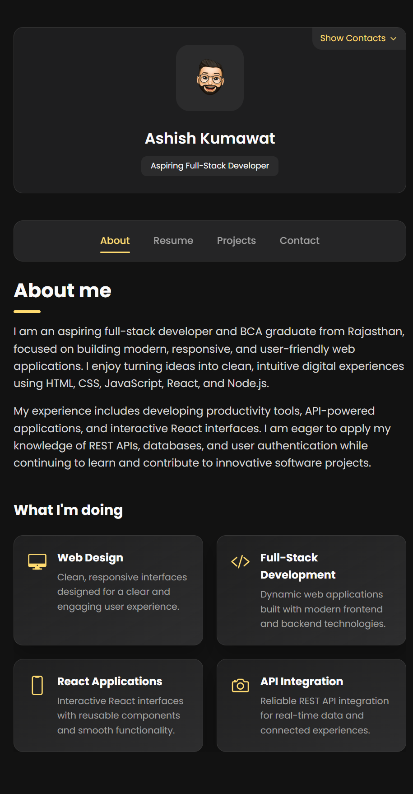

ye # Ashish Kumawat - Personal Portfolio

A responsive personal portfolio website for Ashish Kumawat, an aspiring full-stack developer and BCA graduate. The site presents professional information, education, certifications, technical skills, projects, and contact details in a clean dark interface.

## Portfolio Preview

## Features

- Responsive portfolio layout for desktop and mobile screens
- Sidebar with contact information and social links
- About section with professional summary
- Resume section with education, experience, certifications, and skills
- Projects section connected to GitHub repositories and live project pages
- Project category filtering
- Contact form layout and location map
- Blog section hidden from the navigation

## Tech Stack

- HTML5
- CSS3
- JavaScript
- Ionicons
- Google Fonts - Poppins

## Featured Projects

- [Task Management](https://github.com/Ashish-kumawat1/first-projects/tree/main/Task%20Management) - Productivity application for creating, organizing, and tracking tasks.
- [Weather Dashboard](https://github.com/Ashish-kumawat1/first-projects/tree/main/Weather%20Dashboard) - Weather application using the OpenWeather API.
- [Ochi React Interface](https://github.com/Ashish-kumawat1/ochi) - Interactive React and Vite interface with responsive design.
- [Quiz Site](https://github.com/Ashish-kumawat1/quiz-site1) - Browser-based JavaScript quiz application.
- [React Portfolio Template](https://github.com/Ashish-kumawat1/portfolio-by-microsoft-temple) - Customizable React portfolio template.

## Certifications

- [Full Stack Developer](https://skillsoft.digitalbadges.skillsoft.com/0eaf578d-d539-44cd-841f-11935c0ab6e0#acc.H7fElCGg) - Skillsoft Digital Badge
- [GenAI Powered Data Analytics Job Simulation](https://forage-uploads-prod.s3.amazonaws.com/completion-certificates/ifobHAoMjQs9s6bKS/gMTdCXwDdLYoXZ3wG_ifobHAoMjQs9s6bKS_68b1bb3e457ff98b460f16fb_1756482508574_completion_certificate.pdf) - Forage

## Run Locally

1. Clone or download this repository.
2. Open the project folder.
3. Open `index.html` in a browser.

No build step or package installation is required.

## Contact

- Email: kumawatashish842@gmail.com
- Location: Uniara, Tonk, Rajasthan
- GitHub: [Ashish-kumawat1](https://github.com/Ashish-kumawat1)
- LinkedIn: [Ashish Kumawat](https://www.linkedin.com/in/ashish-kumawat-35b577304/)
